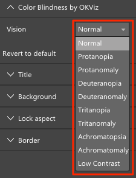

# Color Blindness for Power BI

Color Blindness by OKVIZ is a tiny library to use in Power BI custom visuals.
It allows to apply different color visions to any visual that implement it.



For more information about color blindness, see our post at http://okviz.com/color-blindness/


### How to use it

Here is a step-by-step guide to implement the library:

1.	Create a new custom visual or load an existing one.
Note that if you never developed a custom visual before, you should read the Microsoft official documentation at https://github.com/Microsoft/PowerBI-visuals.

2.	Copy the [colorblind.ts](src/colorblind.ts) file into your src folder. 

3.	Open the [tsconfig.json](tsconfig.json) file and append the following string to “files” section:

    ```typescript
    "src/colorblind.ts",
    ```

4.	Open the [capabilities.json](capabilities.json) file and edit the “objects” section as described below:

    ```typescript
    "objects": {
        //... (all the other visual properties here),
        
        "colorBlind": {
            "displayName": "Color Blindness by OKViz",
            "properties": {
                "vision": {
                    "displayName": "Vision",
                    "type": {
                            "enumeration": [
                            {
                                "displayName": "Normal",
                                "value": "Normal"
                            },
                                {
                                "displayName": "Protanopia",
                                "value": "Protanopia"
                            },
                                {
                                "displayName": "Protanomaly",
                                "value": "Protanomaly"
                            },
                                {
                                "displayName": "Deuteranopia",
                                "value": "Deuteranopia"
                            },
                                {
                                "displayName": "Deuteranomaly",
                                "value": "Deuteranomaly"
                            },
                            {
                                "displayName": "Tritanopia",
                                "value": "Tritanopia"
                            },
                            {
                                "displayName": "Tritanomaly",
                                "value": "Tritanomaly"
                            },
                            {
                                "displayName": "Achromatopsia",
                                "value": "Achromatopsia"
                            },
                            {
                                "displayName": "Achromatomaly",
                                "value": "Achromatomaly"
                            },
                            {
                                "displayName": "Low Contrast",
                                "value": "LowContrast"
                            }
                            ]
                        }
                }
            }
        }
    },
    ```

5.	Create two properties in your **iVisual** class:

    ```typescript
    private element: d3.Selection<HTMLElement>;
    private vision: string;
    ```

6.	Append this code in the **constructor()** function:

    ```typescript
    this.element = d3.select(options.element);
    this.vision = "Normal";
    ```

7.	Append this code at the end of the **update()** function:

    ```typescript
    if (options.dataViews && options.dataViews[0] && options.dataViews[0].metadata && options.dataViews[0].metadata.objects) {
        let colorBlindObj = options.dataViews[0].metadata.objects ["colorBlind"];
        if (colorBlindObj) {
            let vision = <string>colorBlindObj["vision"];
            if (vision !== undefined) {
                this.vision = vision;
            }
        }
    }

    OKVizUtility.applyColorBlindVision(this.vision, this.element);
    ```

8.	Edit the code of the **enumerateObjectInstances()** function as described below:

    ```typescript
    let objectName = options.objectName;
    let objectEnumeration: VisualObjectInstance[] = [];

    switch(objectName) {

        //… (all the other visual properties here),

        case "colorBlind":
                        
                objectEnumeration.push({
                    objectName: objectName,
                        properties: {
                            "vision": this.vision
                        },
                        selector: null
                });
                break;
    }
    return objectEnumeration;
    ```

9.	You’re done, enjoy!


### Copyright

Copyright (c) OKVIZ Corp.

See the [LICENSE](/LICENSE) file for license rights and limitations (MIT).
